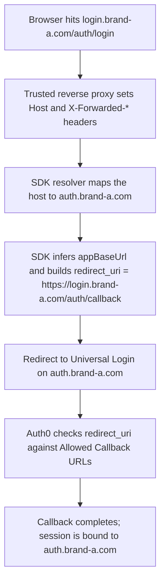

# Examples

Step-by-step walkthroughs for `@auth0/auth0-tanstack-start-react` on TanStack Start
(server-rendered Regular Web Applications).

A complete, runnable version of the setup basics lives in
[`examples/basic-rwa`](./examples/basic-rwa). The samples below match the patterns that app uses.

## Table of contents

**Setup**

1. [Configure Auth0](#1-configure-auth0)
2. [Create the server auth instance](#2-create-the-server-auth-instance)
3. [Register the middleware](#3-register-the-middleware)
4. [Wire auth state into the router](#4-wire-auth-state-into-the-router)
5. [Auth routes](#5-auth-routes)

**Everyday use**

6. [Protect routes](#6-protect-routes)
7. [Read auth state in components](#7-read-auth-state-in-components)
8. [Fetch protected data](#8-fetch-protected-data)
9. [Protect server functions](#9-protect-server-functions)

**Enterprise features**

10. [Multi-factor authentication](#10-multi-factor-authentication)
11. [Organizations](#11-organizations)
12. [Account linking](#12-account-linking)
13. [CIBA back-channel authentication](#13-ciba-back-channel-authentication)
14. [Custom token exchange](#14-custom-token-exchange)
15. [Token Vault](#15-token-vault)
16. [Passkeys](#16-passkeys)
17. [Multiple Custom Domains (MCD)](#17-multiple-custom-domains-mcd)

**Configuration and tooling**

18. [Session configuration](#18-session-configuration)
19. [Stateful session store](#19-stateful-session-store)
20. [Error handling](#20-error-handling)
21. [Testing](#21-testing)

---

## 1. Configure Auth0

Create a **Regular Web Application** in the Auth0 Dashboard, then set the following environment
variables. These are read on the server, so never prefix them with `VITE_`.

```sh
AUTH0_DOMAIN=your-tenant.auth0.com
AUTH0_CLIENT_ID=your-client-id
AUTH0_CLIENT_SECRET=your-client-secret
AUTH0_SECRET=$(openssl rand -hex 32)
APP_BASE_URL=http://localhost:3000
```

`AUTH0_SECRET` encrypts the session cookie and must be at least 32 bytes. The command above
generates a suitable value.

In the application settings in the Dashboard:

- **Allowed Callback URLs**: `http://localhost:3000/auth/callback`
- **Allowed Logout URLs**: `http://localhost:3000`

## 2. Create the server auth instance

Create one Auth0 instance for the whole app. `auth0Server()` reads the environment variables from
step 1, and you can pass options to override any of them.

```ts
// src/auth.server.ts
import { auth0Server } from '@auth0/auth0-tanstack-start-react/server'

export const auth0 = auth0Server()
```

For staging and preview deployments, `appBaseUrl` also accepts a list of allowed origins. The
incoming request origin must match one entry in the list.

```ts
export const auth0 = auth0Server({
  appBaseUrl: ['https://app.example.com', 'https://staging.example.com'],
})
```

## 3. Register the middleware

`src/start.ts` is the global entry point. TanStack Start compiles it into both the client and the
server bundle, and import-protection forbids it from statically importing any server-only module.

Import `auth0Middleware` from the dedicated `/server/middleware` entry point rather than the
`/server` barrel. That entry point has a small, client-safe static graph and loads all server-only
work lazily inside its handler. Call it with no arguments so it reads configuration from the
environment. Do not pass it your `auth.server` instance, because that would reintroduce a
server-only import into this file.

```ts
// src/start.ts
import { createStart } from '@tanstack/react-start'
import { auth0Middleware } from '@auth0/auth0-tanstack-start-react/server/middleware'

export const startInstance = createStart(() => ({
  requestMiddleware: [auth0Middleware()],
}))
```

The middleware intercepts the `/auth/*` endpoints (login, callback, logout, profile, and
back-channel logout) and attaches `context.auth0` to every other request.

## 4. Wire auth state into the router

Seed the router context with the SDK sentinel, and set `auth0BeforeLoad()` on the root route so
`context.auth0` is populated for the entire route tree. Wrap the app in `Auth0Provider` so the
hooks and components can read the auth state.

```ts
// src/router.tsx
import { createRouter } from '@tanstack/react-router'
import { auth0RouterContext } from '@auth0/auth0-tanstack-start-react/client'
import type { Auth0RouterContext } from '@auth0/auth0-tanstack-start-react/types'
import { routeTree } from './routeTree.gen'

// TanStack Start requires this export to be named `getRouter`.
export function getRouter() {
  return createRouter({
    routeTree,
    context: { auth0: auth0RouterContext } as { auth0: Auth0RouterContext },
  })
}
```

```tsx
// src/routes/__root.tsx
import { createRootRouteWithContext, Outlet } from '@tanstack/react-router'
import { Auth0Provider, auth0BeforeLoad } from '@auth0/auth0-tanstack-start-react/client'
import type { Auth0RouterContext } from '@auth0/auth0-tanstack-start-react/types'

export const Route = createRootRouteWithContext<{ auth0: Auth0RouterContext }>()({
  beforeLoad: auth0BeforeLoad(),
  component: () => (
    <Auth0Provider>
      <Outlet />
    </Auth0Provider>
  ),
})
```

## 5. Auth routes

With `auth0Middleware()` registered in step 3, the `/auth/*` endpoints (`login`, `callback`,
`logout`, `profile`, and `backchannel-logout`) are served automatically, before TanStack Router
runs. You do not need to add a route file for them.

To use different paths, pass a `routes` config to `auth0Server()`. Change the shared prefix with
`base`, or override any individual path. Remember to update the **Allowed Callback URLs** and
**Allowed Logout URLs** in the Auth0 Dashboard to match.

```ts
export const auth0 = auth0Server({
  routes: {
    base: '/authentication', // moves every endpoint under /authentication/*
    callback: '/authentication/oidc-callback', // or override a single path
  },
})
```

**Advanced, opt-out only.** If you deliberately choose not to register the middleware, you can mount
the handlers in a catch-all route instead. A route file is part of the client route tree, so it must
not statically import a server-only module such as `~/auth.server`. Wrap the handlers in a
server-only module and load it lazily so import-protection is satisfied.

```ts
// src/routes/auth/$.ts
import { createFileRoute } from '@tanstack/react-router'
import { createServerFn } from '@tanstack/react-start'

const handle = createServerFn().handler(async () => {
  const { auth0Handlers } = await import('@auth0/auth0-tanstack-start-react/server')
  const { auth0 } = await import('~/auth.server')
  const { GET, POST } = auth0Handlers(auth0)
  // Dispatch to GET or POST based on the request method and path.
})
```

For almost all apps, register the middleware and skip this.

## 6. Protect routes

Use a pathless layout route so a single guard covers a whole subtree. `requireAuth` redirects
unauthenticated users to the login route and preserves the intended destination as `returnTo`.

```ts
// src/routes/_authenticated.tsx
import { createFileRoute } from '@tanstack/react-router'
import { requireAuth } from '@auth0/auth0-tanstack-start-react/client'

export const Route = createFileRoute('/_authenticated')({
  beforeLoad: requireAuth({ returnTo: '/dashboard' }),
})
```

`requireOrg('org_xyz')` guards a route so that only members of a given organization can enter. For
roles or permissions, check the exact claim on the server with `withApiClaimIncludes` or
`withApiClaimEquals` (see [section 9](#9-protect-server-functions)).

### How guards read auth state

Every guard reads `context.auth0`, which carries a `status` field:

| Status | Meaning | Guard behavior |
| --- | --- | --- |
| `resolved` | Auth state is known. This is the normal case, since `auth0Middleware` resolves it on the server before the page is sent. | Redirects only if the user is not authenticated. |
| `loading` | Auth state is still being determined. | Waits without redirecting. |
| `unresolved` | The context was never populated. | Treats the request as unauthenticated and redirects to login. |

Because an unpopulated context redirects rather than passing, a misconfiguration fails closed rather
than letting a request through. `unresolved` almost always means a setup problem: `auth0Middleware`
is not registered in `start.ts`, or `Auth0Provider` or `auth0BeforeLoad()` is not wired into the
root route (steps 3 and 4). In development, the SDK logs a warning when a guard hits this state. It
can also happen briefly during a client-side navigation or preload that runs before `Auth0Provider`
has populated its cache, and redirecting is the safe behavior there too.

The `useAuth0()` hook exposes the same `status`, plus an `isLoading` convenience that is `true` only
while `status` is `loading`. `isLoading` is `false` when `status` is `unresolved`, so a
misconfigured app does not sit behind an endless loading spinner.

## 7. Read auth state in components

The client hooks and components read the auth state that was resolved on the server.

```tsx
import {
  useUser,
  useLogin,
  useLogout,
  SignedIn,
  SignedOut,
} from '@auth0/auth0-tanstack-start-react/client'

function Nav() {
  const user = useUser()
  const login = useLogin()
  const logout = useLogout()
  return (
    <nav>
      <SignedIn>
        <span>Hi {user?.name}</span>
        <button onClick={() => logout()}>Log out</button>
      </SignedIn>
      <SignedOut>
        <button onClick={() => login('/dashboard')}>Log in</button>
      </SignedOut>
    </nav>
  )
}
```

There is no drop-in sign-in button, because login is a redirect to Auth0's Universal Login page.
To start it, send the user to the login route: call `useLogin()` (which also lets you pass a
`returnTo`), or use a plain link, `<a href="/auth/login">Log in</a>`. Logout works the same way
through `useLogout()` or `<a href="/auth/logout">`.

The full set of hooks and components:

| Name | Kind | Purpose |
| --- | --- | --- |
| `useAuth0()` | hook | Returns `{ user, isAuthenticated, status, isLoading }`. |
| `useUser()` | hook | Shorthand for the current `user`, or `undefined`. |
| `useOrg()` | hook | Returns the current `Organization` from the `org_id` and `org_name` claims, or `undefined`. |
| `useLogin()` | hook | Returns a function that redirects to the login route, with an optional `returnTo`. |
| `useLogout()` | hook | Returns a function that clears the client cache and redirects to logout. |
| `SignedIn` | component | Renders its children only when the user is authenticated. |
| `SignedOut` | component | Renders its children only when the user is not authenticated. |
| `HasOrg` | component | Renders its children when the user's `org_id` matches, with an optional `fallback`. |
| `AuthReady` | component | Renders its children once `status` is `resolved`. |
| `AuthLoading` | component | Renders its children while `status` is `loading`. |

```tsx
import { HasOrg } from '@auth0/auth0-tanstack-start-react/client'

function AdminPanel() {
  return (
    <HasOrg orgId="org_admins" fallback={<p>You do not have access.</p>}>
      <SecretControls />
    </HasOrg>
  )
}
```

## 8. Fetch protected data

Tokens stay on the server, so the browser never holds an access token. To fetch protected data, call
a server function that reads the token on the server and returns only the data.

A server function that is reachable from the client route tree must not statically import a
server-only module. Keep the server-only logic (which imports your `auth.server` instance) in a
separate `*.server.ts` file, and load it with a dynamic `import()` inside the `.handler()`, which
runs only on the server.

```ts
// src/data.server.ts
import { getAccessToken } from '@auth0/auth0-tanstack-start-react/server'
import { auth0 } from '~/auth.server'

export async function loadInvoices() {
  const { token } = await getAccessToken(auth0)
  const res = await fetch('https://api.example.com/invoices', {
    headers: { Authorization: `Bearer ${token}` },
  })
  return res.json()
}
```

```ts
// src/data-fns.ts (imported by components; imports nothing server-only)
import { createServerFn } from '@tanstack/react-start'

export const getInvoices = createServerFn({ method: 'GET' }).handler(async () => {
  const { loadInvoices } = await import('./data.server')
  return loadInvoices()
})
```

```tsx
// component: call the server function; the token never reaches the browser
import { useServerFn } from '@tanstack/react-start'
import { getInvoices } from '~/data-fns'

function Invoices() {
  const load = useServerFn(getInvoices)
  // Call load() from an event or effect, then render the returned data.
}
```

`createFetcher` is a convenient alternative when you make several calls to the same API. It returns a
`fetch`-compatible function that attaches the current access token as a Bearer header on every
request.

```ts
// src/data.server.ts
import { createFetcher } from '@auth0/auth0-tanstack-start-react/server'
import { auth0 } from '~/auth.server'

export async function loadInvoices() {
  const fetcher = createFetcher(auth0, { audience: 'https://api.example.com' })
  const res = await fetcher('https://api.example.com/invoices')
  return res.json()
}
```

You can pair either approach with TanStack Query on the client. The `queryFn` calls the server
function, so the client still never handles a token directly.

## 9. Protect server functions

Server functions attach `context.auth0` through middleware. Use `requireAuthMiddleware` for flows
that should redirect, and the API middleware family for JSON APIs that should return HTTP errors.

The middleware attaches the router context, which carries `user`, `isAuthenticated`, `status`, and
`isLoading`. It does not carry tokens. Read the user identity from `context.auth0.user`, and read
tokens with `getSession(auth0)` or `getAccessToken(auth0)`.

```ts
import { createServerFn } from '@tanstack/react-start'
import {
  requireAuthMiddleware,
  withApiScopes,
} from '@auth0/auth0-tanstack-start-react/server'
import { auth0 } from '~/auth.server'

// Redirect flow: unauthenticated users are sent to the login route.
const getDashboard = createServerFn()
  .middleware([requireAuthMiddleware(auth0)])
  .handler(({ context }) => ({ userId: context.auth0.user?.sub }))

// JSON API flow: a missing scope throws ForbiddenError (HTTP 403).
const getReports = createServerFn()
  .middleware([withApiScopes(auth0, ['read:reports'])])
  .handler(() => ({ reports: [] }))
```

The full middleware family:

| Middleware | Behavior when the check fails |
| --- | --- |
| `auth0FunctionMiddleware(auth0)` | Never blocks. Attaches `context.auth0`, where `user` may be `undefined`. |
| `requireAuthMiddleware(auth0)` | Redirects to the login route. |
| `requireOrgMiddleware(auth0, orgId)` | Redirects to the login route with the organization parameter. |
| `withApiAuth(auth0)` | Throws `UnauthorizedError` (HTTP 401). |
| `withApiScopes(auth0, scopes)` | Throws `ForbiddenError` (HTTP 403) when the access token is missing any scope. |
| `withApiOrg(auth0, orgId)` | Throws `ForbiddenError` when `org_id` does not match. |
| `withApiClaimEquals(auth0, claim, value)` | Throws `ForbiddenError` when the claim does not equal the value. |
| `withApiClaimIncludes(auth0, claim, ...values)` | Throws `ForbiddenError` when the array claim includes none of the values. |

`getSession(auth0)` returns the current session on the server, or `null` when there is none. The
session holds the authenticated state for the request: the user identity claims (`session.user`)
alongside token data. Reach for it in any server function, loader, or route handler that needs the
signed-in user or their session.

```ts
import { getSession } from '@auth0/auth0-tanstack-start-react/server'

const getProfile = createServerFn().handler(async () => {
  const session = await getSession(auth0)
  if (!session) throw new Error('Unauthorized')
  return { sub: session.user.sub, email: session.user.email }
})
```

If you only need the user, read it directly:

```ts
const user = (await getSession(auth0))?.user
```

## 10. Multi-factor authentication

MFA verification runs on the server. Wrap the `/server` MFA helpers in server functions, then drive
them from a component with `useMfa`. The typical flow is: an operation triggers `mfa_required`, you
list the enrolled factors, challenge one, and verify the code. If the user has no factors, enroll
one first.

```ts
// src/mfa.server.ts
import { createServerFn } from '@tanstack/react-start'
import {
  mfaGetAuthenticators,
  mfaChallenge,
  mfaVerify,
  mfaEnroll,
} from '@auth0/auth0-tanstack-start-react/server'
import { auth0 } from '~/auth.server'

export const getAuthenticatorsFn = createServerFn()
  .inputValidator((d: { mfaToken: string }) => d)
  .handler(({ data }) => mfaGetAuthenticators(auth0, data))

export const challengeFn = createServerFn()
  .inputValidator((d: { mfaToken: string; authenticatorId?: string; challengeType: 'otp' | 'oob' }) => d)
  .handler(({ data }) => mfaChallenge(auth0, data))

export const verifyFn = createServerFn()
  .inputValidator((d: Parameters<typeof mfaVerify>[1]) => d)
  .handler(({ data }) => mfaVerify(auth0, data))

export const enrollFn = createServerFn()
  .inputValidator((d: Parameters<typeof mfaEnroll>[1]) => d)
  .handler(({ data }) => mfaEnroll(auth0, data))
```

```tsx
import { useMfa } from '@auth0/auth0-tanstack-start-react/client'

const mfa = useMfa({
  getAuthenticators: (i) => getAuthenticatorsFn({ data: i }),
  challenge: (i) => challengeFn({ data: i }),
  verify: (i) => verifyFn({ data: i }),
  enroll: (i) => enrollFn({ data: i }),
})

const factors = await mfa.getAuthenticators(mfaToken)
await mfa.challenge(factors[0].id, { mfaToken, challengeType: 'otp' })
await mfa.verify({ mfaToken, factorType: 'otp', otp: '123456' })
```

A successful `verify` writes the elevated tokens into the session. Re-read the session afterward to
observe the new state.

## 11. Organizations

Reading the current organization and guarding routes by organization is covered by `useOrg()` and
`requireOrg('org_x')`. This section covers the two flows that require re-authentication: switching
organizations and accepting an invitation. Both return the Auth0 authorization URL, and the caller
issues the redirect.

```ts
import { switchOrg, acceptOrgInvitation } from '@auth0/auth0-tanstack-start-react/server'

// Switch to a different organization, then redirect to the returned URL.
const url = await switchOrg(auth0, { organization: 'org_xyz', returnTo: '/' })

// Accept an invitation. The invitation link looks like:
// /invite?organization=org_abc&invitation=inv_xyz
const url2 = await acceptOrgInvitation(auth0, { organization, invitation })
```

The existing session is replaced atomically when the user completes the new login, so the old
organization session cannot leak into the new one.

## 12. Account linking

Account linking connects a secondary identity, such as a Google account, to the current user. It has
its own callback, separate from login, which you complete with `completeConnectAccount`. Unlinking
follows the same shape with `disconnectAccount` and `completeDisconnectAccount`.

```ts
import {
  connectAccount,
  completeConnectAccount,
  resolveAppBaseUrl,
  toSafeRedirect,
} from '@auth0/auth0-tanstack-start-react/server'

// Start linking, then redirect to the returned URL.
// connectionScope is required; pass an empty string only if you want no extra scopes.
const url = await connectAccount(auth0, {
  connection: 'google-oauth2',
  connectionScope: 'email profile',
  returnTo: '/settings',
})

// In the dedicated callback route, complete the link and redirect.
const request = getRequest()
const appBaseUrl = resolveAppBaseUrl(auth0.config.appBaseUrl, request)
const { appState } = await completeConnectAccount(auth0, new URL(request.url))
// Validate returnTo before using it as a redirect target. connectAccount
// already drops off-origin values when storing it; this second check keeps a
// hand-rolled callback safe too.
const returnTo = toSafeRedirect(appState?.returnTo ?? '/', appBaseUrl) ?? appBaseUrl
return new Response(null, { status: 302, headers: { Location: returnTo } })
```

> **Open-redirect safety.** `returnTo` usually comes from a query parameter, so
> it is attacker-influenceable. `connectAccount` validates it against your app's
> origin before storing it, and the callback above validates it again before
> redirecting. Never place `appState.returnTo` directly into a `Location` header
> without `toSafeRedirect`.

## 13. CIBA back-channel authentication

Client-Initiated Backchannel Authentication (CIBA) authenticates a user through their own device
without a browser redirect. It is well suited to transaction approvals. The call resolves once the
user approves on their device, and the session is then established. The foundation polls Auth0
internally while it waits.

```ts
import { backchannelAuthentication } from '@auth0/auth0-tanstack-start-react/server'

await backchannelAuthentication(auth0, {
  loginHint: { sub: 'auth0|123' },
  bindingMessage: 'Approve payment of $42 to Acme',
})
// The session is now established. Read it with getSession(auth0).
```

`bindingMessage` is shown on the user's device so they know what they are approving. `loginHint.sub`
identifies the user by their Auth0 `sub`. The call throws if the tenant does not have CIBA enabled,
the user denies the request, or the request expires.

## 14. Custom token exchange

Custom token exchange swaps an external or legacy token for Auth0 tokens (RFC 8693) and persists the
session. It effectively logs the user in without an interactive browser flow, which is useful when
bridging an existing token into an Auth0 session. This requires a Token Exchange Profile configured
in the tenant.

```ts
import { customTokenExchange } from '@auth0/auth0-tanstack-start-react/server'

await customTokenExchange(auth0, {
  subjectToken: legacyToken,
  subjectTokenType: 'urn:acme:legacy-token',
  audience: 'https://api.example.com',
})
// The session is now established. Read it with getSession(auth0).
```

## 15. Token Vault

Token Vault exchanges the current session's refresh token for an access token issued by an upstream
federated connection, such as Google. Use it to call that provider's APIs on the user's behalf. This
requires an active session with a refresh token.

```ts
import { getAccessTokenForConnection } from '@auth0/auth0-tanstack-start-react/server'

const { accessToken } = await getAccessTokenForConnection(auth0, {
  connection: 'google-oauth2',
})
// Use accessToken against the Google API.
```

## 16. Passkeys

Passkeys (WebAuthn) span the client and the server. The SDK provides the server half, and the
browser performs the WebAuthn ceremony in between. The flow has three steps:

1. On the server, call `passkeyRegister` (new user) or `passkeyChallenge` (existing user) to get a
   WebAuthn challenge (`authnParamsPublicKey`) and an `authSession`.
2. In the browser, pass `authnParamsPublicKey` to `navigator.credentials.create()` for registration
   or `navigator.credentials.get()` for login, which produces a `credential`.
3. On the server, call `passkeyGetToken` with the `authSession` and the serialized `credential` to
   exchange them for tokens and persist the session.

Wire steps 1 and 3 as server functions that the browser calls. Step 2 runs in the component.

```ts
// src/passkey.server.ts
import { createServerFn } from '@tanstack/react-start'
import {
  passkeyChallenge,
  passkeyGetToken,
} from '@auth0/auth0-tanstack-start-react/server'
import { auth0 } from '~/auth.server'

export const challengeFn = createServerFn().handler(() => passkeyChallenge(auth0))

export const getTokenFn = createServerFn()
  .inputValidator((d: Parameters<typeof passkeyGetToken>[1]) => d)
  .handler(({ data }) => passkeyGetToken(auth0, data))
```

```tsx
// component: run the WebAuthn ceremony between the two server calls
const { authSession, authnParamsPublicKey } = await challengeFn()
const credential = await navigator.credentials.get({ publicKey: authnParamsPublicKey })
await getTokenFn({ data: { authSession, credential } })
```

For a new user, use `passkeyRegister`, which requires at least one of `email`, `username`, or
`phoneNumber`, and then `navigator.credentials.create()`.

## 17. Multiple Custom Domains (MCD)

Multiple Custom Domains lets one deployed app serve several branded custom domains that all front the
**same** Auth0 tenant, for example `login.brand-a.com` and `login.brand-b.com`. Each request is
handled with the Auth0 domain that matches the host the user arrived on.

Use it when a single app instance is reached through more than one custom domain. If you have just one
domain, keep passing a plain string and skip this section.

### Configure a domain resolver

Instead of a fixed `domain` string, pass a function. It receives the incoming request and returns the
Auth0 custom domain to use. When you use a resolver, `appBaseUrl` becomes optional: the SDK infers it
per request from the `X-Forwarded-Host` (or `Host`) and `X-Forwarded-Proto` headers.

```ts
// src/auth.server.ts
import { auth0Server } from '@auth0/auth0-tanstack-start-react/server'

// Map each app host to its Auth0 custom domain. Keep this as a fixed, trusted
// table. Do not build the domain from arbitrary request input.
const DOMAINS: Record<string, string> = {
  'login.brand-a.com': 'auth.brand-a.com',
  'login.brand-b.com': 'auth.brand-b.com',
}

export const auth0 = auth0Server({
  domain: (request) => {
    const host = request.headers.get('x-forwarded-host') ?? request.headers.get('host')
    const domain = host ? DOMAINS[host] : undefined
    if (!domain) {
      throw new Error(`No Auth0 custom domain configured for host: ${host}`)
    }
    return domain
  },
  // clientId / clientSecret / secret still come from options or the environment.
  // appBaseUrl is optional here; it is inferred from the request host.
})
```

The resolver may be async (for example, if you look the mapping up from a config service), and it must
return a non-empty domain host. Everything else in this guide (guards, hooks, tokens, enterprise
flows) works unchanged; the SDK selects the right Auth0 domain for you on every call.

### How a request flows



### Register each custom domain's callback in Auth0

For every custom domain, add its callback and logout URLs to the Auth0 application settings, for
example `https://login.brand-a.com/auth/callback` and `https://login.brand-b.com/auth/callback`. Auth0
rejects any `redirect_uri` that is not on this list, so this is also a safety net (see below).

> [!CAUTION]
> ### Security: host headers and the trusted proxy requirement
> In MCD mode the SDK trusts the request `Host` and `X-Forwarded-Host` / `X-Forwarded-Proto` headers to infer the app base URL. It does not validate them, so **you must deploy behind a trusted reverse proxy or edge** (for example Cloudflare, Nginx, or AWS ALB) that:
>
> - sets `X-Forwarded-Host` and `X-Forwarded-Proto` from the real request, and
> - strips or overwrites any client-supplied values so they cannot be spoofed.
>
> Without that, an attacker could send a forged `X-Forwarded-Host` and influence the inferred base URL.
>
> Two things keep this safe when the proxy is configured correctly:
>
> - **Map from a trusted set.** Resolve the domain from a fixed table of known custom domains, as above. Never derive the Auth0 domain directly from untrusted request input.
> - **Auth0's Allowed Callback URLs are the backstop.** The inferred host becomes the `redirect_uri` sent to Auth0. Auth0 rejects any `redirect_uri` that is not a registered Allowed Callback URL, so a spoofed host cannot complete a login even if it reached the resolver.

## 18. Session configuration

Pass `sessionConfiguration` to `auth0Server()` to control the session cookie and its lifetime. This
is the session configuration type from `@auth0/auth0-server-js`, so any value you set takes effect.

```ts
import { auth0Server } from '@auth0/auth0-tanstack-start-react/server'

export const auth0 = auth0Server({
  sessionConfiguration: {
    rolling: true,
    absoluteDuration: 60 * 60 * 24 * 7, // seven days, in seconds
    inactivityDuration: 60 * 60 * 24, // one day, in seconds
    cookie: {
      name: '__my_session',
      sameSite: 'lax',
      secure: true,
      path: '/',
    },
  },
})
```

The cookie's `secure` flag defaults to the protocol of your application's base URL. If you set the
cookie with `secure: false`, or `sameSite: 'none'` without `secure`, while running in production, the
SDK logs a warning, because those settings weaken the session cookie.

If you do not pass `sessionConfiguration`, the session still has a bounded lifetime. The SDK does not
set its own defaults; it inherits them from underlying `@auth0/auth0-server-js`, which uses an `absoluteDuration`
of `3 days`, an `inactivityDuration` of `1 day`, and `rolling` set to `true`. These values cap both
the cookie's `maxAge` and the encrypted session's expiry, so a session cookie is never kept around
without an end date. Set the fields above to change them.

## 19. Stateful session store

By default the session is stateless: the whole encrypted session lives in the cookie. To store the
session body on the server instead and keep only a session identifier in the cookie, pass a
`sessionStore`. This suits large sessions and lets you revoke sessions from your backend.

```ts
import { auth0Server } from '@auth0/auth0-tanstack-start-react/server'
import { redis } from '~/redis'

export const auth0 = auth0Server({
  sessionStore: {
    async get(id) {
      const value = await redis.get(`session:${id}`)
      return value ? JSON.parse(value) : undefined
    },
    async set(id, value) {
      await redis.set(`session:${id}`, JSON.stringify(value))
    },
    async delete(id) {
      await redis.del(`session:${id}`)
    },
    async deleteByLogoutToken(claims) {
      // Delete the session matching the back-channel logout token claims.
      if (claims.sid) await redis.del(`session:${claims.sid}`)
    },
  },
})
```

The store must implement `get`, `set`, `delete`, and `deleteByLogoutToken`. The last one lets Auth0
end a session through [back-channel logout](#5-auth-routes). When a `sessionStore` is supplied,
sessions become stateful automatically. When it is omitted, sessions stay stateless.

The store holds the session body, which includes the user claims and tokens, so you own its security.
Use a store that encrypts data at rest, set a `TTL` on each entry that matches your session lifetime,
and make sure expired entries are evicted. The SDK cannot enforce any of this on a store it does not
control, so treat it the same way you would treat any store of sensitive data.

> **Logout is not server-side revocation in stateless mode.** With the default stateless (cookie
> only) sessions, the whole session lives in the browser cookie. Logout clears that cookie on the
> current browser, but there is no server-side record to revoke, so a cookie that was copied or
> leaked stays valid until it expires on its own. This matches how the other cookie-based Auth0 SDKs
> behave. If you need to revoke a session on demand from your backend, use a stateful `sessionStore`,
> where deleting the stored entry ends the session immediately.

> **Back-channel logout requires a stateful session store.** With the default stateless (cookie
> only) sessions, there is no server-side record to delete by logout token, so the
> `/auth/backchannel-logout` endpoint cannot end the session and responds with a `501` configuration
> error. To use back-channel logout, configure a `sessionStore` as shown above.

## 20. Error handling

The SDK throws typed error classes from the `/errors` entry point. Every SDK error extends the
built-in `Error` and carries a stable `code`, so you can branch on the class or the code.

```ts
import {
  InvalidConfigurationError,
  MissingSessionError,
  AccessTokenError,
  UnauthorizedError,
  ForbiddenError,
  CallbackError,
} from '@auth0/auth0-tanstack-start-react/errors'

try {
  const { token } = await getAccessToken(auth0)
} catch (error) {
  if (error instanceof AccessTokenError) {
    // The token could not be obtained; prompt the user to log in again.
  }
}
```

| Error | Meaning |
| --- | --- |
| `InvalidConfigurationError` | Required configuration is missing or invalid. |
| `MissingSessionError` | No valid session exists where one is required. |
| `AccessTokenError` | An access token could not be obtained. |
| `UnauthorizedError` | A request lacks a valid session or token (HTTP 401). |
| `ForbiddenError` | The session lacks the required scopes or claims (HTTP 403). |
| `CallbackError` | Auth0 returned an error during the login callback. |

For the enterprise flows, the `/server` entry point also re-exports the foundation's error classes
so you can check them with `instanceof`: `MfaChallengeError`, `MfaEnrollmentError`,
`MfaListAuthenticatorsError`, `MfaVerifyError`, `StartLinkUserError`, `PasskeyChallengeError`,
`PasskeyGetTokenError`, and `PasskeyRegisterError`, plus the `isMfaRequiredError` helper.

## 21. Testing

The `/testing` entry point provides utilities for component tests, router-guard tests, and SSR
integration tests.

```ts
import {
  createMockAuth0Context,
  Auth0TestProvider,
  createMockAuth0Client,
  generateSessionCookie,
} from '@auth0/auth0-tanstack-start-react/testing'
```

**Component tests.** Wrap the component in `Auth0TestProvider` so the SDK hooks and components have a
context to read.

```tsx
render(
  <Auth0TestProvider user={{ sub: 'auth0|1', name: 'Alice' }}>
    <App />
  </Auth0TestProvider>,
)
```

**Router-guard tests.** Seed the test router context with `createMockAuth0Context`. Pass `status` to
exercise the loading and unresolved paths.

```ts
const authed = createMockAuth0Context({ user: { sub: 'auth0|1' } })
const unresolved = createMockAuth0Context({ status: 'unresolved' })
```

**Server-function tests.** Use `createMockAuth0Client` in place of the real instance. It stubs the
session, tokens, and the MFA, organization, linking, CIBA, and passkey surfaces.

```ts
const auth0 = createMockAuth0Client({
  session: { user: { sub: 'auth0|1' }, accessToken: 'test-token' },
})
```

**SSR integration tests.** `generateSessionCookie` produces a real encrypted session cookie you can
inject into a test request to simulate an authenticated session. The `secret` must match the one
passed to `auth0Server()`.

```ts
const cookie = await generateSessionCookie({
  secret: process.env.AUTH0_SECRET!,
  user: { sub: 'auth0|1' },
})
```

